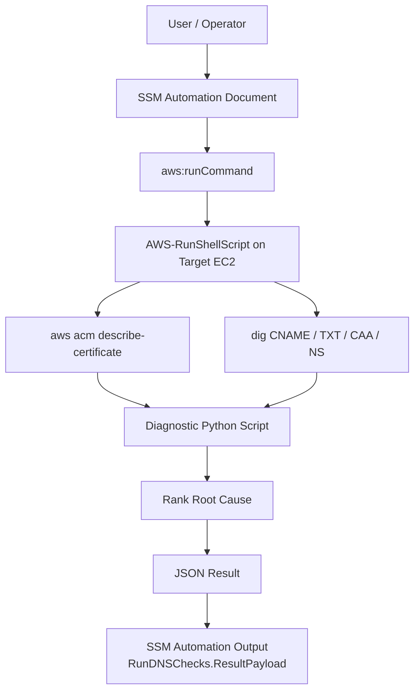

# ACM DNS Validation Checker - Run Command Version

## Background

AWS Certificate Manager (ACM) DNS validation looks simple on the surface: ACM gives you a CNAME record, you add it to DNS, and the certificate should move from `Pending validation` to `Issued`.

In real environments, many users do not immediately realize that they must create the ACM-provided CNAME record in their DNS provider. Even when they know a CNAME is required, they often need to move back and forth between ACM, Route 53 or another DNS provider, public DNS lookup tools, and AWS documentation to understand what is wrong.

I built this runbook to reduce that manual investigation. Instead of making an engineer check each DNS concept one by one, the automation collects the certificate metadata, checks the most likely DNS failure points, identifies the most likely root cause, and returns a remediation message that can be acted on.

This version intentionally uses **SSM Run Command** and runs the diagnostic script on an EC2 instance. That choice keeps the DNS behavior close to what an operator would check manually with `dig`, and it avoids packaging external Python DNS libraries into the SSM Automation runtime. The tradeoff is that a prepared EC2 instance is required.

## What It Checks

- Validates the ACM certificate ARN format.
- Calls `acm:DescribeCertificate` in the certificate's region.
- Exits early for non-DNS validation methods.
- Exits early when the certificate is already `ISSUED` or `EXPIRED`.
- Checks whether each ACM DNS validation CNAME exists.
- Compares the public CNAME value with the ACM expected value.
- Detects TXT records at the exact ACM CNAME validation name.
- Checks whether CAA records authorize Amazon CA issuance.
- Compares parent NS delegation with authoritative NS records.
- Handles multi-domain and SAN certificates by checking all `DomainValidationOptions`.
- Marks renewal-related failures when ACM returns `RenewalSummary`.

## Architecture



## Main Possible Causes

When multiple issues are found, the runbook chooses the most important issue as the primary `RootCause`.

| Order | Root Cause | Meaning |
| --- | --- | --- |
| 1 | `CNAME_MISSING` | ACM validation CNAME does not exist in public DNS. |
| 2 | `CNAME_MISMATCH` | CNAME exists, but the value does not match ACM's expected value. |
| 3 | `TXT_CONFLICT` | TXT exists at the exact CNAME validation name. |
| 4 | `CAA_BLOCKING` | CAA records do not authorize Amazon CA issuance. |
| 5 | `NS_INCONSISTENCY` | Parent delegation and authoritative NS records differ. |
| 6 | `RENEWAL_FAILURE` | Certificate appears to be in renewal flow and DNS may have changed. |

## Files

| File | Purpose |
| --- | --- |
| `acm_dns_validation_checker_runcommand.yaml` | SSM Automation document that runs the diagnostic script through `aws:runCommand`. |
| `README.md` | Usage guide for the Run Command version. |

## Prerequisites

### Target EC2 Instance

The target instance must have:

- SSM Agent installed and online.
- Network access to AWS APIs.
- Access to public DNS resolvers.
- `python3`.
- AWS CLI.
- `dig`.

Recommended lightweight target instance:

```text
Instance type: t3.micro
OS: Amazon Linux 2023
Storage: 8 GiB gp3
Network: outbound access to AWS APIs and public DNS
Packages: python3, aws cli, bind-utils
```

The script is not CPU or memory intensive. A small utility instance is enough as long as SSM Agent is online and `dig` is available.

Install `dig` if needed:

```bash
# Amazon Linux / RHEL
sudo yum install -y bind-utils

# Ubuntu / Debian
sudo apt-get update
sudo apt-get install -y dnsutils
```

### IAM Permissions

The SSM Automation role and/or the target instance profile must allow the actions used by this runbook.

Minimum required permissions:

```json
{
  "Version": "2012-10-17",
  "Statement": [
    {
      "Effect": "Allow",
      "Action": [
        "acm:DescribeCertificate",
        "ssm:SendCommand",
        "ec2:DescribeInstances"
      ],
      "Resource": "*"
    }
  ]
}
```

Depending on how the automation document is created and executed in your account, additional Systems Manager permissions may be required, such as `ssm:StartAutomationExecution` and `ssm:GetAutomationExecution`.

## Deploy the SSM Document

Create the Automation document from the Systems Manager console, or use the CLI if you prefer:

```bash
aws ssm create-document \
  --name ACM-DNS-Validation-Checker-RunCommand \
  --document-type Automation \
  --document-format YAML \
  --content file://acm_dns_validation_checker_runcommand.yaml
```

## Run the Automation

You can run the document from the Systems Manager Automation console.

Required inputs:

| Parameter | Description |
| --- | --- |
| `AutomationAssumeRole` | IAM role ARN used by SSM Automation. |
| `CertificateArn` | ACM certificate ARN to diagnose. |
| `InstanceId` | Target EC2 instance where the script runs. |

After the execution finishes, check the `RunDNSChecks.ResultPayload` output.

## Example Output

```json
{
  "RootCause": "CNAME_MISSING",
  "Summary": "CNAME not found at _abc.example.com.",
  "AllIssues": "CNAME_MISSING(example.com)",
  "Remediation": "Create CNAME: _abc.example.com. -> _xyz.acm-validations.aws.",
  "CertificateArn": "arn:aws:acm:ap-southeast-1:123456789012:certificate/...",
  "Status": "PENDING_VALIDATION",
  "Domain": "example.com",
  "IsFailed": "False",
  "IsRenewal": "False"
}
```

## Known Limitations

- This version requires an EC2 instance. That is the biggest tradeoff of the Run Command design.
- The instance must already have `python3`, AWS CLI, and `dig`.
- The result depends on the target instance's network path and DNS resolver behavior.
- The base domain detection currently uses the last two DNS labels, so domains such as `example.co.uk` need a public suffix aware parser in a future version.
- The ARN validation currently supports the standard `aws` partition. GovCloud and China partitions would need an expanded ARN pattern.
- DNS errors are normalized into empty results in several places, so some timeout or resolver failure cases may appear as missing records.

## Why This Version Uses Run Command

The long-term cleaner design is an `aws:executeScript` Automation document that does not require EC2. However, `aws:executeScript` would need a reliable DNS library strategy, such as bundled `dnspython`, and it would need careful handling for authoritative DNS queries.

For this version, Run Command was a practical first implementation because:

- `dig` gives transparent DNS results that are familiar to operators.
- Parent delegation checks are easier to express with direct `dig` queries.
- No third-party Python dependency package is required.
- The script can be tested on an instance the same way it runs in automation.

## Future Improvements

- Build a v2 using `aws:executeScript` so no EC2 instance is required.
- Replace last-two-label base domain parsing with public suffix list support.
- Return a more structured JSON array for all issues instead of a pipe-separated string.
- Preserve DNS timeout, SERVFAIL, and NXDOMAIN as distinct diagnostic states.
- Add automated test cases with mocked ACM and DNS responses.
